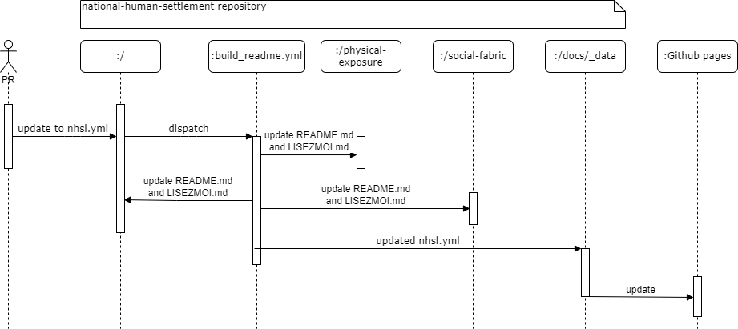

# Automated workflow

Changes to readme and lisezmoi files, and to github pages content are all automated through build_readme.yml when changes are pushed to nhsl.yml. When triggered, build_readme.yml runs generate_files.py in order to make the changes.

The files build_check_links.yml and check_links.yml both check for dead links in github pages, with build_check_links.yml pre-building the site when a PR is opened or changed and checking those links, and check_links.yml checking the entirety of https://opendrr.github.io/downloads/ after changes are pushed, to ensure that no links from other sections have been affected.

generate_assets.yml creates release assets whenever a new release is published. Every file in physical-exposure/data/ and social-fabric/data is added.
